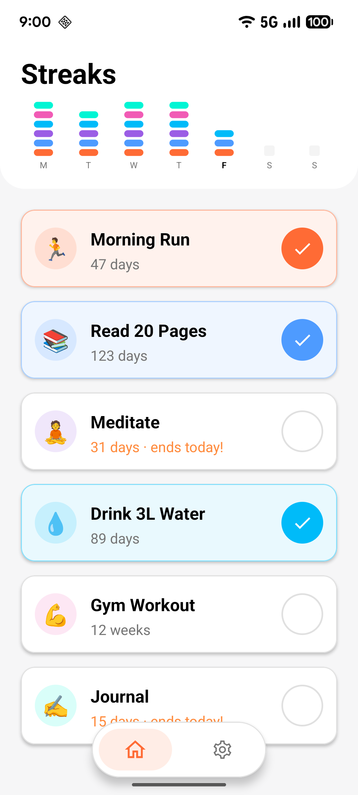
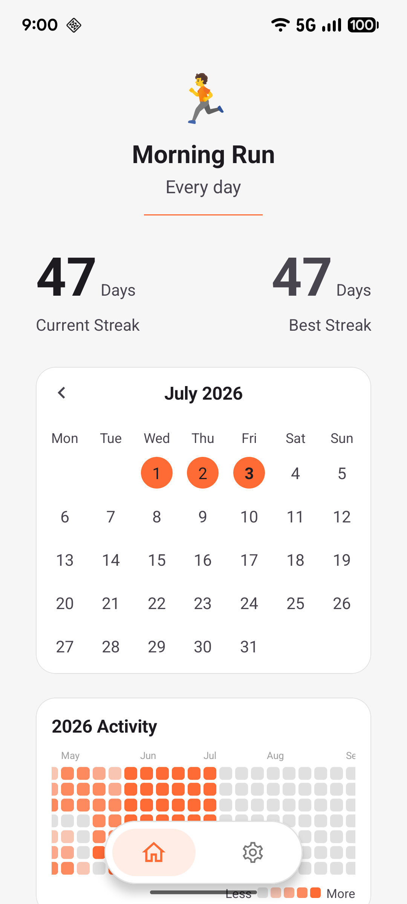
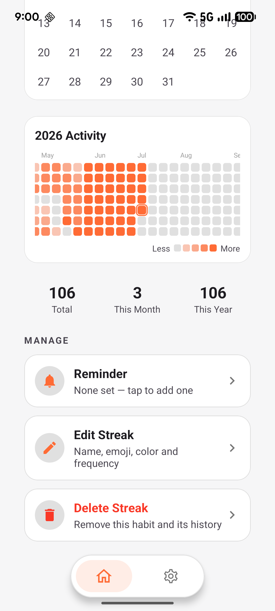
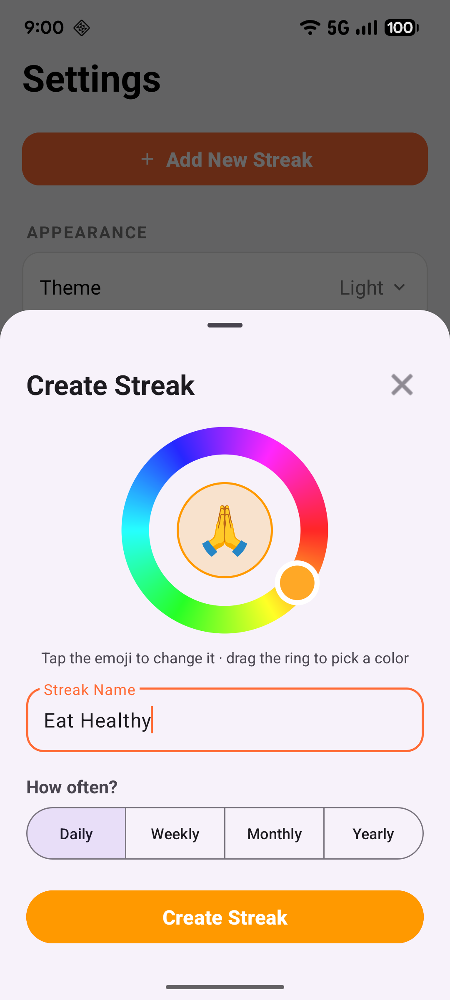
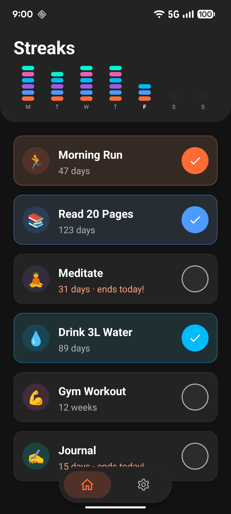
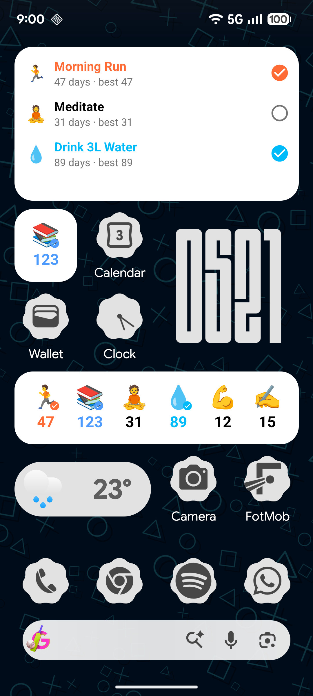
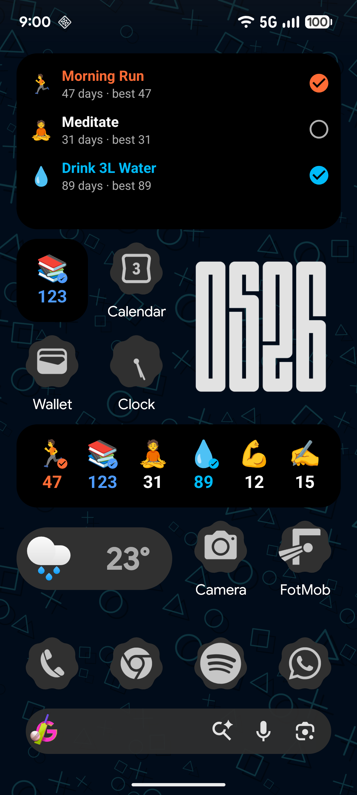

# Streaks - Habit Tracking App

Streaks is an Android application designed to help users build and maintain positive habits through streak tracking. The app provides a clean, intuitive interface for tracking daily, weekly, monthly, and yearly habits with visual progress indicators and customizable reminders.

**🔒 Privacy First: All your habit data stays securely on your device - no cloud storage, no data collection, no tracking.**

## Screenshots

| Home | Details | Year graph | Create |
| :--: | :--: | :--: | :--: |
|  |  |  |  |

| Dark mode | Widgets | Widgets (dark) |
| :--: | :--: | :--: |
|  |  |  |

## Features

### Habit Tracking

- Create and manage multiple habits with custom names and emojis
- Track daily, weekly, monthly, and yearly streaks
- View current and best streaks for each habit
- Visual progress indicators showing completion status
- **All data stored locally on your device**

### Calendar Views

- Monthly calendar view showing habit completion status
- GitHub-style year graph showing activity throughout the year

### Reminders

- Set customizable reminders for each habit
- Choose specific days of the week for reminders
- Set custom reminder times
- Push notifications to keep you on track

### User Interface

- Material Design 3 components and animations
- Smooth transitions and shared element animations
- Dark/light theme support
- Responsive layout adapting to different screen sizes

## Privacy & Data Security

- **100% Local Storage**: All your habit data is stored exclusively on your device in a local JSON file
- **No Internet Required**: The app works completely offline - no network permissions needed
- **No Data Collection**: We don't collect, store, or transmit any personal information
- **No Ads or Tracking**: Clean experience without advertisements or user tracking
- **Your Data, Your Control**: Export, backup, or delete your data anytime

## Technical Details

### Requirements

- Android 8.0 (API level 26) or higher
- Android Studio Arctic Fox or newer
- Kotlin 1.5.0 or higher

### Dependencies

- AndroidX Core Libraries
- Material Design Components
- Navigation Component
- ViewModel and LiveData
- Gson (JSON serialization for local data storage)

### Architecture

The app follows MVVM (Model-View-ViewModel) architecture pattern:

- **Model**: Data classes and the JSON-backed repository
- **View**: Activities and Fragments
- **ViewModel**: Business logic and data management

## Setup

1. Clone the repository
2. Open the project in Android Studio
3. Sync Gradle files
4. Build and run the application

## Contributing

Contributions are welcome! Please feel free to submit a Pull Request.
